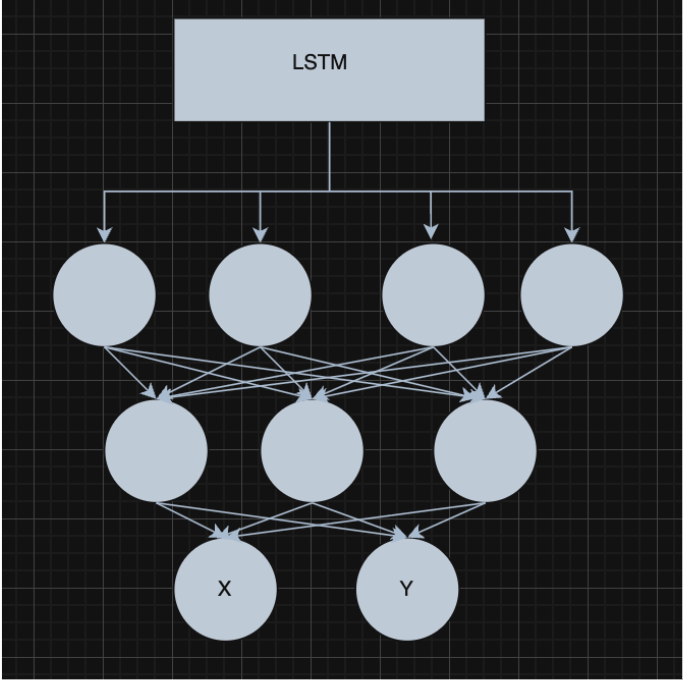
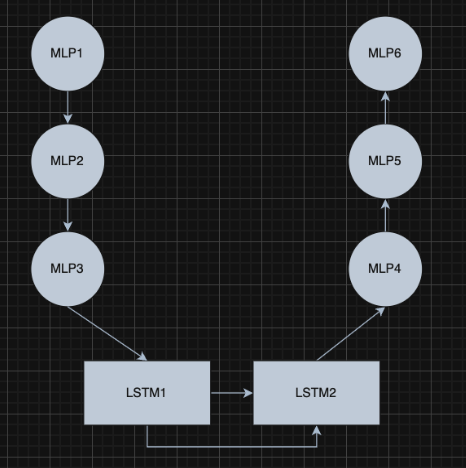
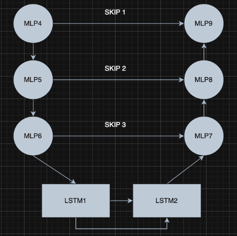
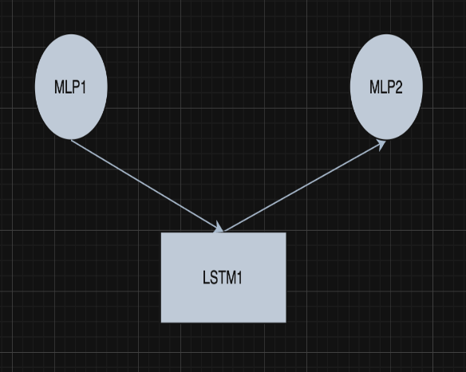
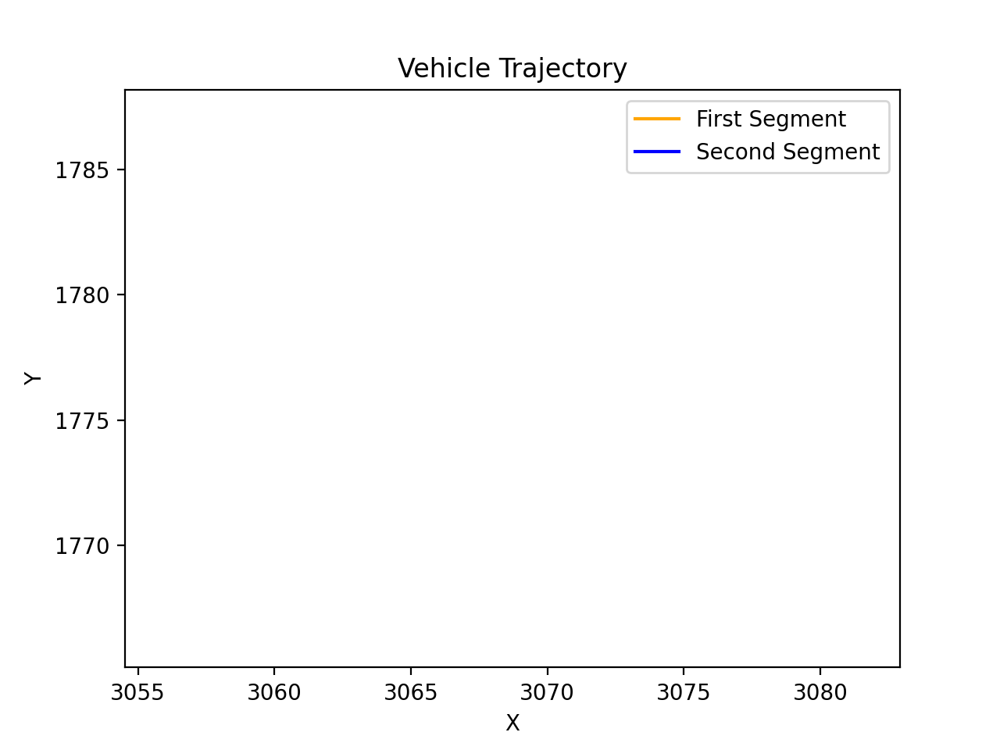
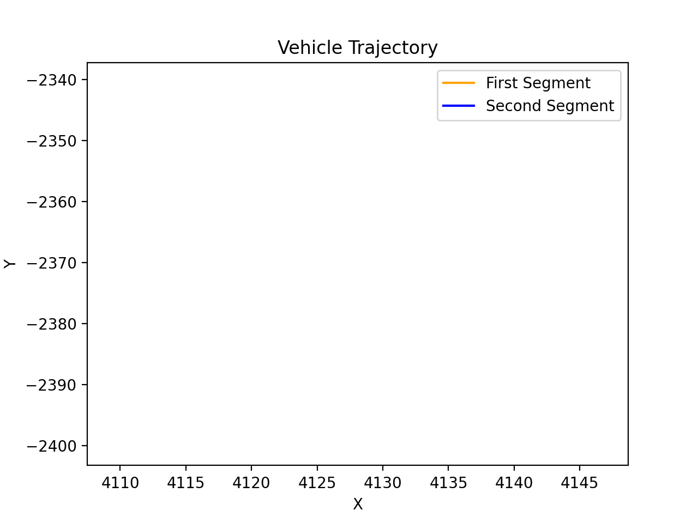
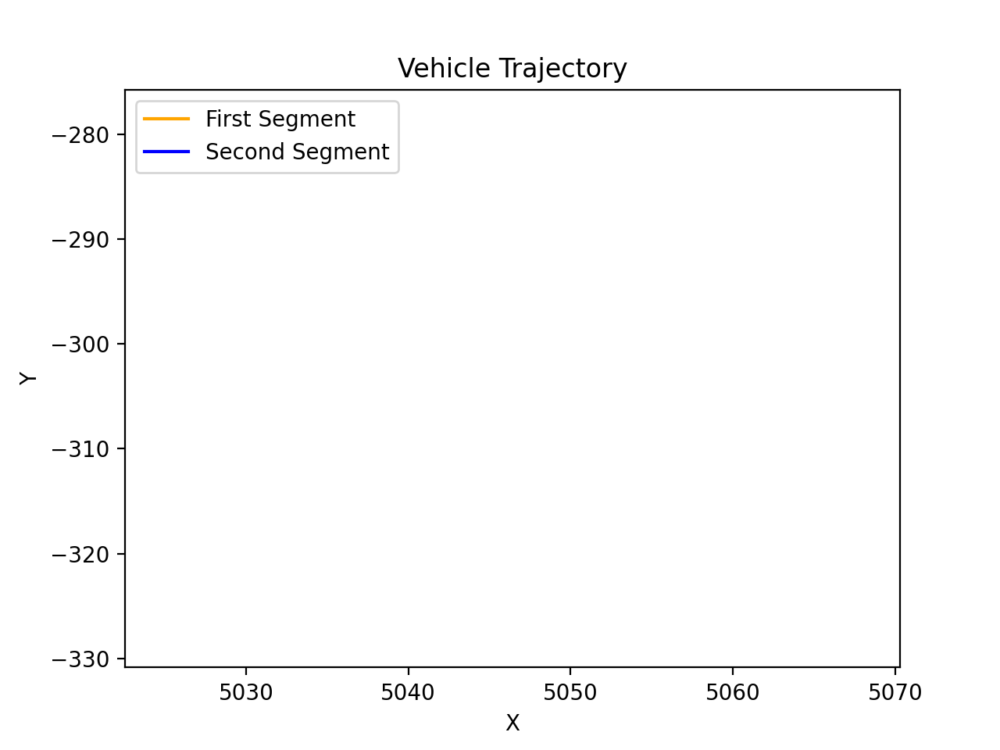

# 🚗 Argoverse-2 Motion Trajectory Prediction

This project focuses on building accurate **motion forecasting models** using the [Argoverse 2 Motion Forecasting Dataset](https://www.argoverse.org/av2.html). You'll work with real-world driving data, pushing the limits of AI in **autonomous vehicle navigation**.

---

## About the Challenge

In real-world driving, predicting the motion of surrounding agents—vehicles, pedestrians, and cyclists—is **critical for safe navigation**.  
This dataset includes:

- 🕒 **11-second scenarios** (2s past, 9s future)
- 🧭 **Centroid + heading data** in **2D bird's-eye view**
- 🔄 **Sampled at 10Hz**
- 🚶‍♂️ Diverse agents with complex behaviors & interactions

###  Objective

Build ML models that predict **future trajectories** of agents with high accuracy in complex, crowded, and unpredictable scenes.

---

## Dataset Summary

| Feature         | Description                               |
|-----------------|-------------------------------------------|
| Sampling Rate   | 10Hz                                      |
| Input           | Past trajectories (50 Timestamps)         |
| Output          | Future trajectories (60 Timestamps)       |
| Agents          | Vehicles, pedestrians, cyclists           |
| Environment     | Real-world urban driving                  |

---

##  Model Architectures

I explored multiple architectures from basic LSTMs to advanced encoder-decoder frameworks and many other Architectures.

<!-- 
###  Architectures

**Architecture 1**  
- 📙 LSTM (1 unit) → MLP (3 layers)
<div align="center">
  
</div>

**Architecture 2**  
- 📗 Encoder (3-layer MLP) → LSTM → Decoder (3-layer MLP)
<div align="center">
  
</div>

**Architecture 3**  
- 📙 Encoder(Smaller MLP Followed by LSTM) and Decoder( Smaller LSTM followed by MLP) Units
<div align="center">
  
</div>

**Architecture 4**  
- 🧱 Encoder(MLP Followed by LSTM) and Decoder(LSTM followed by MLP) Units along with Skip Connections
<div align="center">
  
</div>

**Architecture 5**  
- 📗 Encoder(Single Layer MLP Followed by LSTM) and Decoder(Singler Layer LSTM followed by MLP)
<div align="center">
  
</div> -->

### Architectures

| Architecture | Description | Diagram |
|--------------|-------------|---------|
| **Architecture 1** | LSTM (1 unit) → MLP (3 layers) |  |
| **Architecture 2** | Encoder (3-layer MLP) → LSTM → Decoder (3-layer MLP) |  |
| **Architecture 3** | Encoder (Smaller MLP → LSTM) and Decoder (Smaller LSTM → MLP) |  |
| **Architecture 4** | Encoder (MLP → LSTM), Decoder (LSTM → MLP) + Skip Connections |  |
| **Architecture 5** | Encoder (Single Layer MLP → LSTM), Decoder (Single Layer LSTM → MLP) |  |

# Final Model Transformer

The **Transformer Model** is a deep learning model designed to predict future trajectories based on agent movement data. It processes high-dimensional input features using a multi-layered feedforward encoder that transforms them into a lower-dimensional representation. A transformer encoder then models temporal and inter-agent interactions by capturing dependencies across the input sequence. The model focuses on the first agent (assumed to be the ego agent) for trajectory prediction. The final output is a sequence of predicted 2D coordinates for the specified prediction length. This architecture is well-suited for applications such as autonomous driving or multi-agent tracking.

## Architecture Details

###  Key Parameters:
- `input_dim=550`: Flattened dimension of trajectory data (50 time steps × 11 features).
- `model_dim=256`: Embedding size used throughout the Transformer pipeline.
- `num_heads=8`: Number of self-attention heads in each Transformer layer.
- `num_layers=6`: Depth of the Transformer encoder stack.
- `dropout=0.1`: Applied dropout for regularization.
- `pred_len=60`: Number of future time steps to predict (output).
- `num_agents=50`: Max number of agents in a given scene.
### Total Parameters: 8,261,240

---
## Final Results
- `Final Model`: final1.ipynb
- `Train MSE`: 0.0019361081 
- `Validation MSE`: 0.0106566806 
- `Validation MAE`: 1.9310559519 
- `Validation MSE(True)`: 1.0656687887 
- `Final Test MSE`: 7.47883
- `My Competition Ranking`: 9
- `Kaggle Test Link`: https://www.kaggle.com/competitions/cse-251-b-2025/leaderboard

---

## 🎥 Trajectory Prediction Visualizations
<div align="center">
  
</div>

<div align="center">
  
</div>

<div align="center">
  
</div>

##  Get Started

  Clone the repo:

   ```
   git clone https://github.com/Ishushan02/Self-Driving-Motion-Prediction.git
   cd Argoverse-2-Motion-Trajectory-Prediction
   ```

[](LICENSE.txt)
