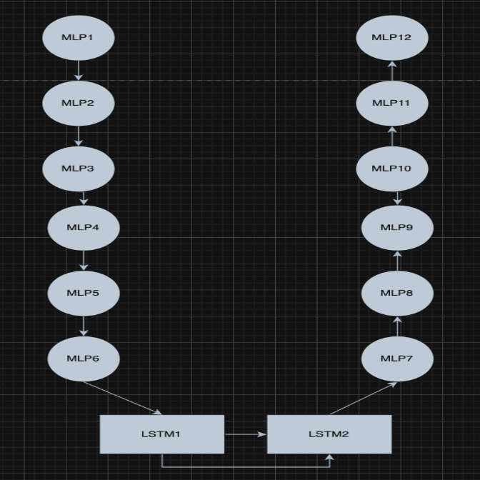

# 🚗 Argoverse-2 Motion Trajectory Prediction 🧠📈

Welcome to the Argoverse 2 Motion Trajectory Prediction Challenge!  
This project focuses on building accurate **motion forecasting models** using the [Argoverse 2 Motion Forecasting Dataset](https://www.argoverse.org/av2.html). You'll work with real-world driving data, pushing the limits of AI in **autonomous vehicle navigation**.

<div align="center">
  
</div>

---

## 📌 About the Challenge

In real-world driving, predicting the motion of surrounding agents—vehicles, pedestrians, and cyclists—is **critical for safe navigation**.  
This dataset includes:

- 🕒 **11-second scenarios** (2s past, 9s future)
- 🧭 **Centroid + heading data** in **2D bird's-eye view**
- 🔄 **Sampled at 10Hz**
- 🚶‍♂️ Diverse agents with complex behaviors & interactions

### 🔍 Objective

Build ML models that predict **future trajectories** of agents with high accuracy in complex, crowded, and unpredictable scenes.

---

## 📁 Dataset Summary

| Feature         | Description                               |
|-----------------|-------------------------------------------|
| Sampling Rate   | 10Hz                                      |
| Input           | Past trajectories (50 Timestamps)         |
| Output          | Future trajectories (60 Timestamps)       |
| Agents          | Vehicles, pedestrians, cyclists           |
| Environment     | Real-world urban driving                  |

---

## 🔧 Model Architectures

I explored multiple architectures from basic LSTMs to advanced encoder-decoder frameworks and many other Architectures.


### **📘 Architectures **

**Architecture 1**  
- 📙 LSTM (1 unit) → MLP (3 layers)
<div align="center">
  
</div>

**Architecture 2**  
- 📗 Encoder (3-layer MLP) → LSTM → Decoder (3-layer MLP)
<div align="center">
  
</div>

**Architecture 3**  
- 📙 Encoder(Smaller MLP Followed by LSTM) and Decoder( Smaller LSTM followed by MLP) Units
<div align="center">
  
</div>

**Architecture 4**  
- 🧱 Encoder(MLP Followed by LSTM) and Decoder(LSTM followed by MLP) Units along with Skip Connections
<div align="center">
  
</div>

**Architecture 5**  
- 📗 Encoder(Single Layer MLP Followed by LSTM) and Decoder(Singler Layer LSTM followed by MLP)
<div align="center">
  
</div>


# Final Model Transformer

## 🚀 Overview

**Model M** is the final architecture selected for trajectory prediction in multi-agent scenarios. It combines the most effective components from prior model iterations (A, B, and F), leading to improved encoding of agent dynamics and better generalization across diverse scenes.

This model was used for **preliminary benchmarking** and serves as a strong baseline for future experiments.

---

## 📐 Architecture Details

###  Key Parameters:
- `input_dim=550`: Flattened dimension of trajectory data (50 time steps × 11 features).
- `model_dim=256`: Embedding size used throughout the Transformer pipeline.
- `num_heads=8`: Number of self-attention heads in each Transformer layer.
- `num_layers=6`: Depth of the Transformer encoder stack.
- `dropout=0.1`: Applied dropout for regularization.
- `pred_len=60`: Number of future time steps to predict (output).
- `num_agents=50`: Max number of agents in a given scene.
### Total Parameters: 8,261,240

---
## Final Results
- `Final Model`: final1.ipynb
- `Train MSE`: 0.0019361081 
- `Validation MSE`: 0.0106566806 
- `Validation MAE`: 1.9310559519 
- `Validation MSE(True)`: 1.0656687887 
- `Final Test Accuracy`: 7.47883
- `My Competition Ranking`: 9
- `Kaggle Test Link`: https://www.kaggle.com/competitions/cse-251-b-2025/leaderboard

## 🎥 Trajectory Prediction Visualizations
<div align="center">
  
</div>

<div align="center">
  
</div>

<div align="center">
  
</div>

## 💻 Get Started

. Clone the repo:

   ```
   git clone https://github.com/yourusername/Argoverse-2-Motion-Trajectory-Prediction.git
   cd Argoverse-2-Motion-Trajectory-Prediction
   ```
